<div align="center">

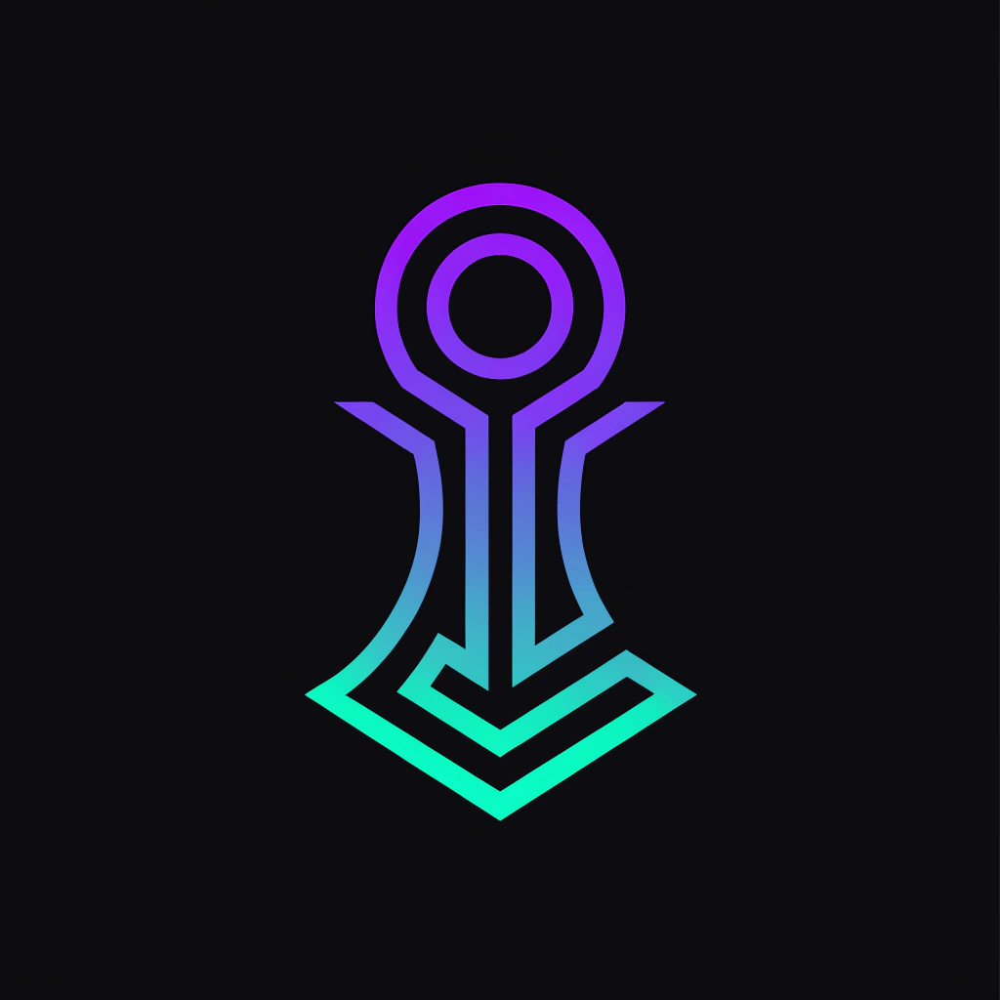


<br clear="both" />

**Solana Mobile Wallet Adapter 2.0.3 plugin for Godot 4 on Android**

[](LICENSE)
[](https://godotengine.org)
[](https://github.com/solana-mobile/mobile-wallet-adapter)
[](https://solana.com)
[](https://developer.android.com)

*Connect Solana wallets from any Godot 4 Android game — one plugin, full MWA 2.0.3 coverage.*

</div>

---

## What Is This?

Godot 4 has no native Solana integration. If you want your Android game or app to connect to Phantom, Solflare, or Jupiter, you're on your own — until now.

**Invoke SDK** is a drop-in Android plugin for Godot 4 that exposes the full [Solana Mobile Wallet Adapter 2.0.3](https://github.com/solana-mobile/mobile-wallet-adapter) API to GDScript via signals and method calls. It handles everything in Kotlin — auth tokens, session caching, transaction building, RPC calls — so your GDScript stays clean.

> **One `.aar` file. One signal interface. Full MWA 2.0.3 coverage.**

---

## Screenshots

<div align="center">

| Splash | Dashboard | Sign Transaction |
|:---:|:---:|:---:|
| 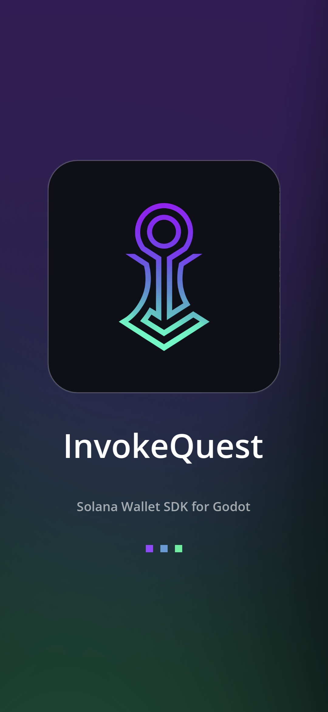 | 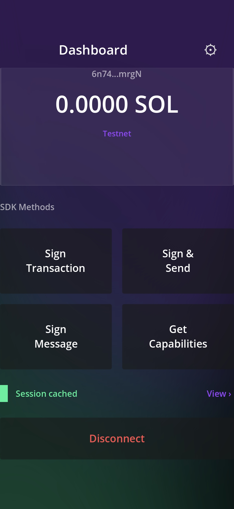 | 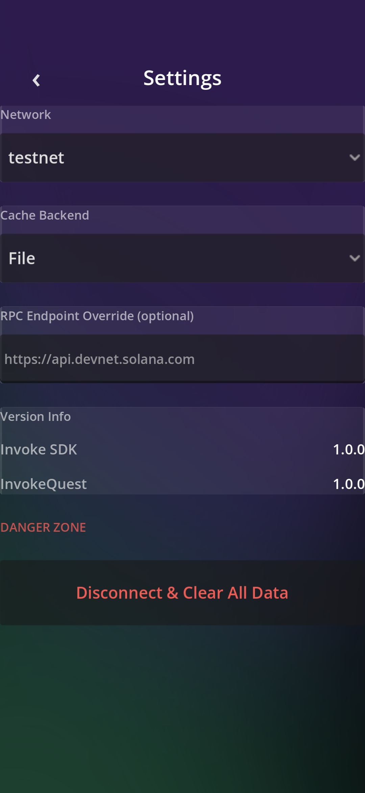 |

| Sign & Send | Sign Message | Capabilities |
|:---:|:---:|:---:|
| 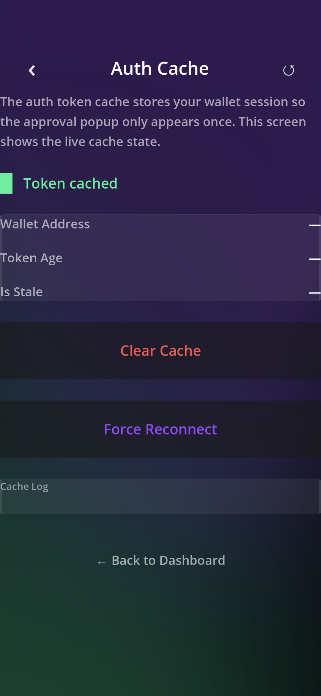 | 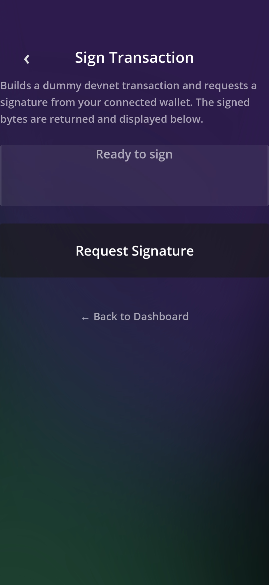 | 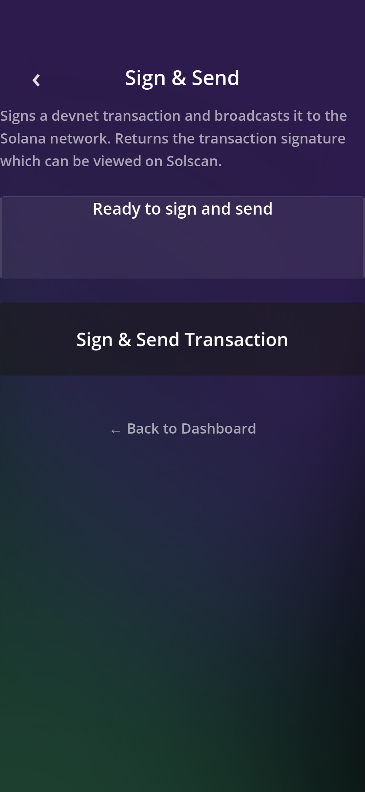 |

| Auth Cache | Settings | Wallet Connected |
|:---:|:---:|:---:|
| 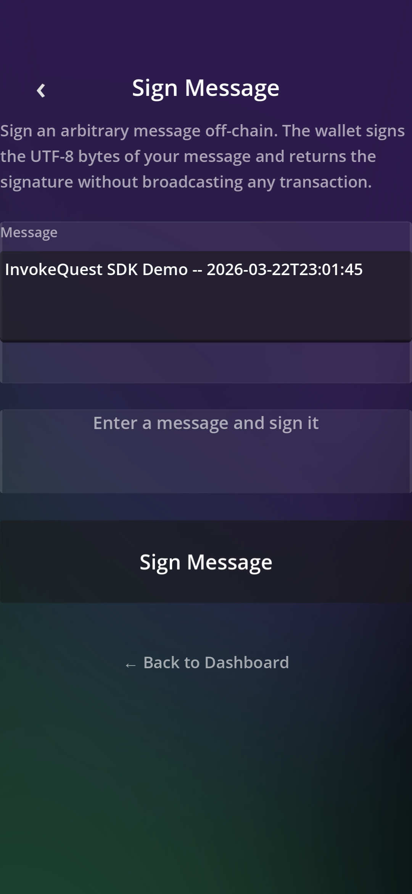 | 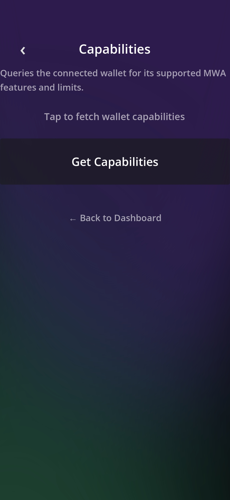 | 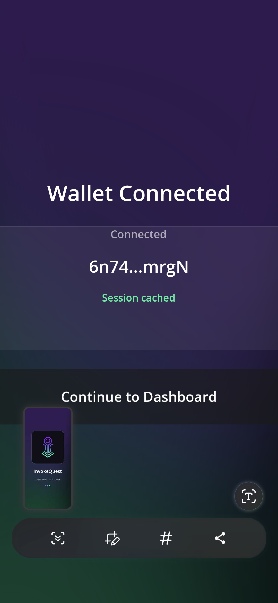 |

</div>

---

## Features

<div align="center">

| 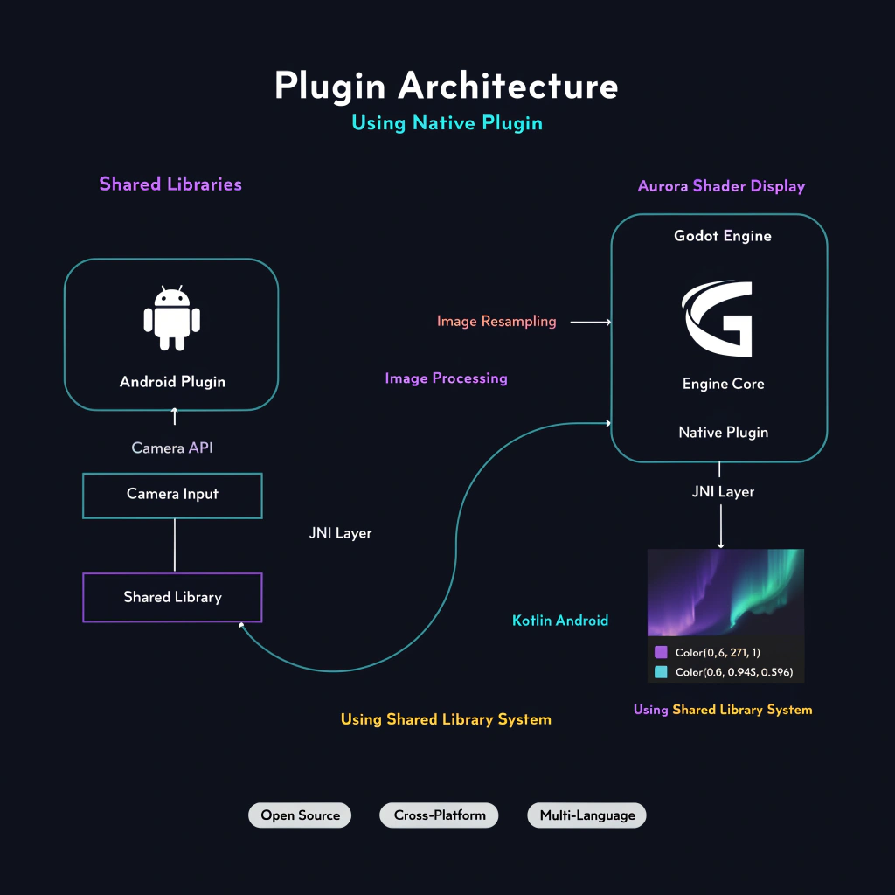 | 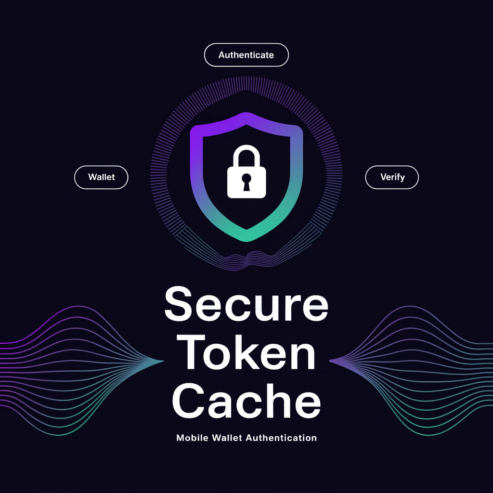 | 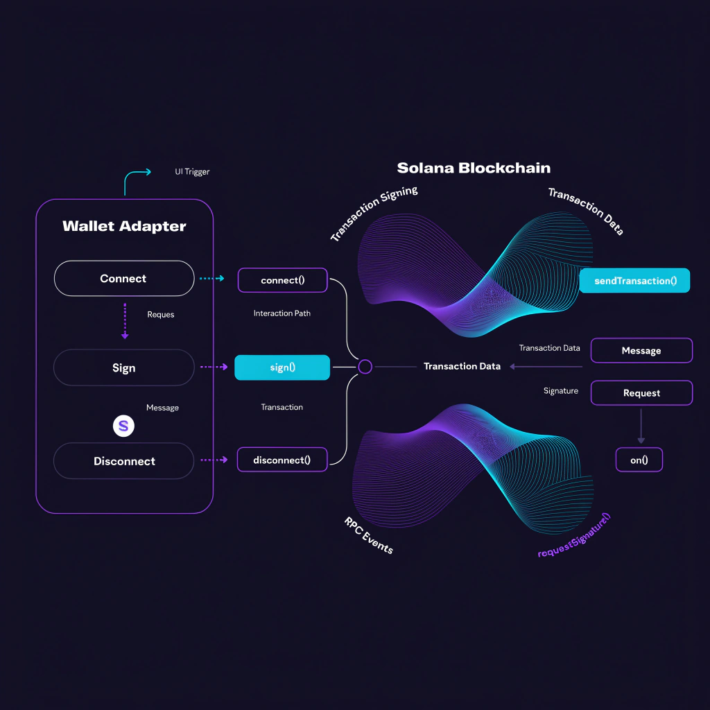 |
|:---:|:---:|:---:|
| **Native Android Plugin** | **Encrypted Token Cache** | **Full MWA API** |
| Kotlin bridge, zero JNI boilerplate | AES256-GCM, silent reconnect in 30 min | Every MWA 2.0.3 method exposed to GDScript |

</div>

| Feature | Status |
|---|---|
| `authorize` — connect wallet, get auth token | ✅ |
| `reauthorize` — refresh existing session | ✅ |
| `deauthorize` — end session | ✅ |
| `signTransactions` — sign raw transactions | ✅ |
| `signAndSendTransactions` — sign + broadcast to network | ✅ |
| `signMessages` — off-chain message signing | ✅ |
| `getCapabilities` — query wallet feature support | ✅ |
| `getInstalledWallets` — detect installed wallets | ✅ |
| Silent reconnect — reuse cached token (< 30 min) | ✅ |
| Auto reauth — wallet picker for stale sessions (< 24h) | ✅ |
| Instant disconnect — no wallet popup | ✅ |
| Encrypted auth token cache (AES256-GCM at rest) | ✅ |
| Real memo transactions — no dummy data | ✅ |
| Network-aware RPC (Devnet / Testnet / Mainnet) | ✅ |
| Full example app — InvokeQuest | ✅ |

---

## Wallet Compatibility

Tested on Samsung Galaxy Android 14, March 2026:

| Wallet | authorize | signTx | signAndSend | signMessage | Notes |
|---|---|---|---|---|---|
| **Solflare** | ✅ | ✅ | ✅ | ✅ | Best for testing |
| **Jupiter** | ✅ | ✅ | ❌ error -3 | ✅ | Strict tx validation |
| **Phantom** | ❌ | — | — | — | Domain not verified |
| **Backpack** | ❌ | — | — | — | MWA 2.0 incompatible |

> MWA always opens the system wallet picker on every sign operation — this is by design, not a bug.

---

## Quick Start

### 1. Copy the AAR

```
cp InvokeMWA.aar YOUR_PROJECT/addons/mobile_wallet_adapter/android/InvokeMWA.aar
```

### 2. Enable the plugin

In Godot editor: **Project → Export → Android → Plugins → InvokeMWA ✅**

### 3. Connect in GDScript

```gdscript
var _mwa = null

func _ready() -> void:
    if Engine.has_singleton("InvokeMWA"):
        _mwa = Engine.get_singleton("InvokeMWA")
        _mwa.authorized.connect(_on_authorized)
        _mwa.mwa_error.connect(_on_mwa_error)

func connect_wallet() -> void:
    _mwa.authorize("solana:devnet", "My Game", "https://mygame.dev", "https://mygame.dev/icon.png")

func _on_authorized(auth_token: String, wallet_address: String) -> void:
    print("Connected: ", wallet_address)

func _on_mwa_error(code: int, message: String) -> void:
    print("Error %d: %s" % [code, message])
```

---

## Full API Reference

### Signals

| Signal | Arguments | Description |
|---|---|---|
| `authorized` | `auth_token: String, address: String` | Wallet connected, new session |
| `reauthorized` | `auth_token: String` | Session refreshed |
| `deauthorized` | — | Session ended |
| `transaction_signed` | `signatures: Array[String]` | Transactions signed (bytes) |
| `transaction_sent` | `signatures: Array[String]` | Transactions broadcast |
| `message_signed` | `signatures: Array[String]` | Messages signed |
| `capabilities_received` | `json: String` | Wallet capabilities JSON |
| `wallet_apps_detected` | `json: String` | Installed wallets JSON |
| `mwa_error` | `code: int, message: String` | Error with code |

### Methods

#### Authorization

```gdscript
# Connect wallet — opens system wallet picker
_mwa.authorize(cluster: String, name: String, uri: String, icon: String)

# Refresh session with existing auth token
_mwa.reauthorize(auth_token: String, name: String, uri: String, icon: String)

# End session
_mwa.deauthorize(auth_token: String)

# Silent reconnect — reads auth token from cache automatically
_mwa.tryReauthorizeFromCache(name: String, uri: String, icon: String)

# Instant disconnect — clears cache, no wallet popup
_mwa.disconnectWallet()
```

#### Signing

```gdscript
# Sign one or more raw transactions (Base64 encoded)
_mwa.signTransactions(transactions: Array[String])

# Sign and broadcast transactions
_mwa.signAndSendTransactions(transactions: Array[String], min_context_slot: int)

# Sign arbitrary messages off-chain
_mwa.signMessages(messages: Array[String], addresses: Array[String])
```

#### Convenience Methods (no auth token needed in GDScript)

```gdscript
# Build and sign a memo transaction — returns signed bytes via transaction_signed
_mwa.signMemoTransaction(memo: String, rpc_url: String)

# Build, sign and broadcast a memo transaction — returns signature via transaction_sent
_mwa.signAndSendMemoTransaction(memo: String, rpc_url: String)

# Sign a text message — returns signature via message_signed
_mwa.signMemoMessage(message: String)
```

#### Discovery

```gdscript
# Query wallet for supported MWA features and limits
_mwa.getCapabilities()

# Detect installed MWA-compatible wallets
_mwa.getInstalledWallets()
```

#### Cache Inspection

```gdscript
_mwa.cacheHasToken()       # → bool
_mwa.cacheGetAddress()     # → String
_mwa.cacheGetAgeSeconds()  # → int
_mwa.cacheIsStale()        # → bool  (true if > 30 min)
_mwa.cacheClear()          # clear active wallet token
_mwa.cacheClearAll()       # clear all wallet tokens
```

### Error Codes

| Code | Constant | Description |
|---|---|---|
| 1001 | `USER_DECLINED` | User rejected the wallet request |
| 1002 | `WALLET_NOT_INSTALLED` | No MWA wallet found on device |
| 1003 | `SESSION_ALREADY_ACTIVE` | A session is already in progress |
| 1004 | `AUTH_TOKEN_INVALID` | Cached token rejected by wallet |
| 1005 | `AUTH_TOKEN_EXPIRED` | Token too old, re-auth required |
| 2001 | `TRANSACTION_EXPIRED` | Transaction blockhash expired |
| 2002 | `TRANSACTION_FAILED` | Transaction rejected by network |
| 2003 | `SIMULATION_FAILED` | Transaction simulation failed |
| 2004 | `INSUFFICIENT_FUNDS` | Wallet has insufficient SOL |
| 2005 | `BLOCKHASH_NOT_FOUND` | RPC blockhash fetch failed |
| 3001 | `NETWORK_TIMEOUT` | Network request timed out |
| 3002 | `RPC_ERROR` | RPC endpoint returned an error |
| 9999 | `UNKNOWN` | Unmapped exception |

---

## Auth Cache — How It Works

The cache eliminates the wallet approval popup on repeat opens. Invoke SDK uses a **three-tier strategy**:

```
App opens → tryReauthorizeFromCache()
  │
  ├─ Token age < 30 min  → Silent reconnect. No wallet interaction. ✅
  │
  ├─ Token age < 24 hrs  → Reauthorize. Wallet picker appears once. ✅
  │
  └─ Token age > 24 hrs  → Session expired. Full authorize required.
```

Auth tokens are stored in `EncryptedSharedPreferences` (AES256-GCM key + AES256-SIV value). Tokens are **never logged** and **never exposed to GDScript** — all cache reads happen in Kotlin.

---

## Project Structure

```
invoke-solana-sdk/
│
├── android/
│   └── plugin/src/main/kotlin/com/invoke/mwa/
│       ├── MWABridge.kt       ← All wallet logic, transaction building, RPC calls
│       ├── MWAPlugin.kt       ← Godot plugin registration, @UsedByGodot methods
│       ├── AuthCacheImpl.kt   ← EncryptedSharedPreferences token cache
│       └── MWAError.kt        ← Error codes and exception mapper
│
├── example/invokequest/
│   ├── scenes/screens/        ← All GDScript screens
│   ├── autoloads/
│   │   ├── DesignTokens.gd    ← Colors, animation constants
│   │   └── SceneManager.gd    ← Push/pop scene navigation
│   └── addons/mobile_wallet_adapter/
│       └── android/InvokeMWA.aar  ← Compiled plugin
│
└── docs/                      ← Docusaurus documentation site
```

---

## Known Limitations

- **Backpack** — MWA 2.0 incompatible, not supported
- **Phantom** — Rejects unverified dApp domains (register at [developer.phantom.app](https://developer.phantom.app))
- **Jupiter signAndSend** — Returns error -3 due to strict transaction validation
- **Silent reconnect** — Only within 30-minute window; stale sessions trigger wallet picker
- **Wallet picker on every sign** — MWA protocol requirement, not a bug

---

## Troubleshooting

**`Engine.has_singleton("InvokeMWA")` returns false**
The plugin is not loaded. Verify `InvokeMWA.aar` is in `addons/mobile_wallet_adapter/android/` and the plugin is enabled in Export settings. Check `AndroidManifest.xml` for `org.godotengine.plugin.v2.InvokeMWA`.

**Wallet picker appears on every app open**
Expected after 30 minutes. Use `tryReauthorizeFromCache()` on app start to silently restore sessions within the window.

**`AUTH_TOKEN_INVALID` (code 1004) after reinstall**
The cached token is stale. Call `cacheClearAll()` once after reinstall, then re-authorize.

**`WALLET_NOT_INSTALLED` (code 1002)**
No MWA-compatible wallet installed. Install [Solflare](https://play.google.com/store/apps/details?id=com.solflare.mobile) or [Jupiter](https://play.google.com/store/apps/details?id=ag.jup.jupiter.android).

**Transaction broadcast fails with `INSUFFICIENT_FUNDS`**
Fund your devnet wallet at [faucet.solana.com](https://faucet.solana.com).

---

## Building from Source

**Prerequisites:** JDK 17, Android SDK, Godot 4.2.2, Python 3.x

```powershell
# 1. Build the AAR
cd android
.\gradlew.bat :plugin:assembleRelease

# 2. Copy AAR to plugin location
Copy-Item "plugin\build\outputs\aar\plugin-release.aar" "..\example\invokequest\addons\mobile_wallet_adapter\android\InvokeMWA.aar" -Force

# 3. Build APK
cd ..\example\invokequest\android\build
.\gradlew.bat assembleRelease
```

See [CONTRIBUTING.md](CONTRIBUTING.md) for the full build pipeline, signing setup, and scene asset workflow.

---

## License

MIT — see [LICENSE](LICENSE)

---

<div align="center">

Built for the **Solana Mobile ecosystem** · Open Source · MIT License

*Solflare · Jupiter · Godot 4 · Android 14 · MWA 2.0.3*

</div>
